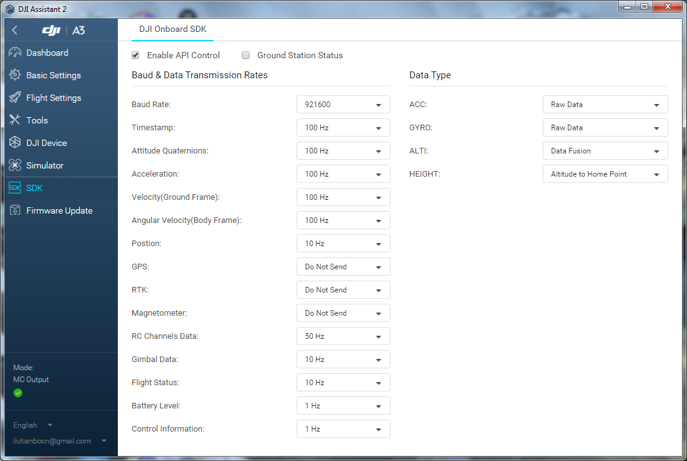

## A modified [dji-sdk/Onboard-SDK-ROS](https://github.com/dji-sdk/Onboard-SDK-ROS) ##

This is a modified version of Onboard-SDK-ROS, which uses standard ros message types, providing limited function of dji-sdk.

### Usage ###

* Modify **CMakeLists.txt** to add Eigen3 to the include directories. It depends on which version of Eigen your are using ( from apt-get, manually installed or other situation)

* If you don't need mvBlueFOX synchronization, just [set ENABLE_DJIFOX to false](https://github.com/groundmelon/djiros/blob/A3/CMakeLists.txt#L22) to eliminate compile errors about mvBlueFOX drivers.

* **launch/djiros.launch** will use environment variables to get APPID and ENCKEY. You can add your id and key in your launch file / set it to the environment / hardcode it in the source code.

* Configure A3 SDK as below
  

### ROS Interfaces ###

#### Parameters ####
* serial_name             [string] : Path to the serial port device (e.g. /dev/ttyUSB0)
* baud_rate               [int]    : Baudrate for serial port
* app_id                  [int]    : App Id for dji sdk
* enc_key                 [string] : App Key for dji sdk
* only_broadcast          [bool]   : No activation and control is needed, just broadcast imu, rc, gps, ...
* align_with_fmu          [bool]   : Use ticks from FMU/ ros::Time::now() when data is received.
* gravity                 [double] : scale multiplied on accelerometer output
* ctrl_cmd_stream_timeout [double] : timeout for judging if control command is streaming in or stopped
* ctrl_cmd_wait_timeout   [double] : timeout for waiting for control command after switch into api mode

#### Topics ###
* See the code and [official documents](https://developer.dji.com/onboard-sdk/documentation/) for published topics and their details.
* Subscriber "~ctrl" for control the drone
* Subscriber "~gimbal_ctrl" and "~gimbal_speed_ctrl" for control the gimbal
